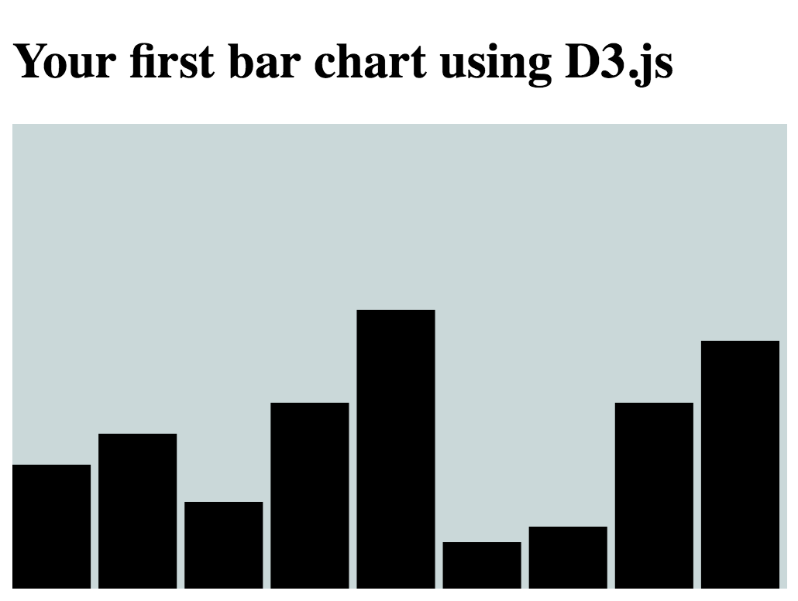

# D3

D3.js is a JavaScript library for data visualization. It uses HTML, SVG, and CSS to display and animate data.

Who built it and why?
Who is maintaining it?

## Example: D3 Bar Chart
A tutorial from ![FreeCodeCamp] (https://medium.freecodecamp.org/how-to-create-your-first-bar-chart-with-d3-js-a0e8ea2df386)

### Instructions to Run

## Recommended Resources
